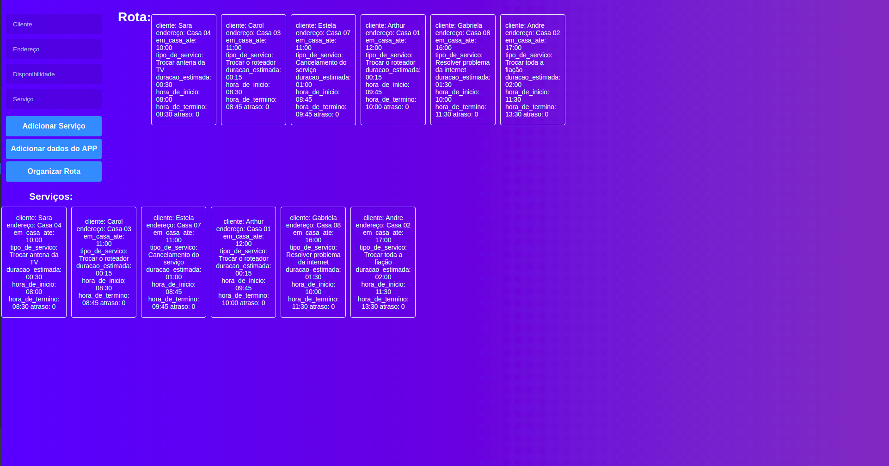

# Agendamento de Serviços

**Número da Lista**: 03 
**Conteúdo da Disciplina**: Greed 

## Alunos
| Matrícula  | Aluno           |
| ---------- | --------------- |
| 16/0111978 | André Eduardo   |
| 16/0112974  | Arthur Rodrigues |

## Sobre 

[O projeto se encontra aqui](https://projeto-de-algoritmos.github.io/Greed_Dupla08B)

[O video se encontra aqui](https://youtu.be/szRVWMYI2JE)
O projeto consiste em ajudar um trabalhador de uma empresa de serviços de internet, televisão e telefone. Essa ajuda virá por meio de um algoritmo ambicioso que formará o melhor agendamento de tarefas de manutenção, entre outras, com o menor atraso possível.

## Screenshots

Tela inicial do projeto

Apertando em Adicionar

Tela inicial do projeto

## Instalação 
**Linguagem**: Javascript 
**Framework**: React 

Primeiramente utilizaremos a ferramenta [git](https://git-scm.com/downloads) que é necessária para clonar o repositório:

    $ git clone https://github.com/projeto-de-algoritmos/Greed_Dupla08B

Após clonar o repositório, é preciso acessar a pasta raiz do projeto:

    Exemplo para o linux:

    $ cd Greed_Dupla08B

Para rodar o projeto é necessário ter instalado o [yarn](https://classic.yarnpkg.com/pt-BR/docs/install/#debian-stable) na versão estável mais atual.

Após instalar o yarn, vamos instalar as dependências do projeto.

    Na pasta raiz, execute:

    $ yarn install

Depois, subir o servidor:

    $ yarn start

E então acessar no navegador:

    http://localhost:3000/

## Uso 
A tela inicial do projeto terá um formulário onde o cliente poderá colocar informações sobre o seu nome, endereço, disponibilidade e tipo de serviço que deseja agendar.

Pode ser adicionado cada solicitação manualmente e gerar o melhor agendamento.

Também existe uma opção que "carrega" dados provindos de um app da empresa que facilita o contato entre empresa e cliente. Dados como nome, endereço, disponibilidade e tipo de serviço. Esses dados vêm no formato de lista de objetos.

Os dados vindos da opção acima obviamente são falsos, foi colocado somente para agilizar um teste de melhor agendamento na aplicação.

## Outros

